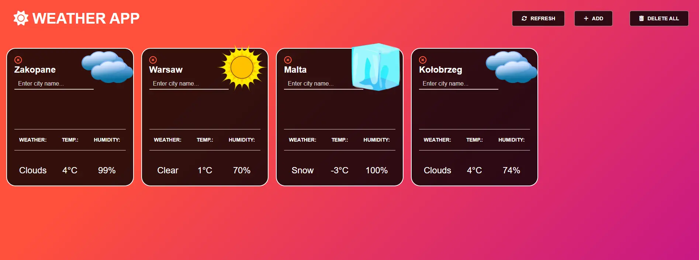
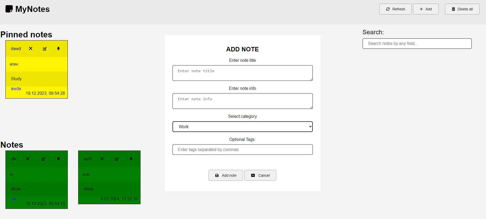
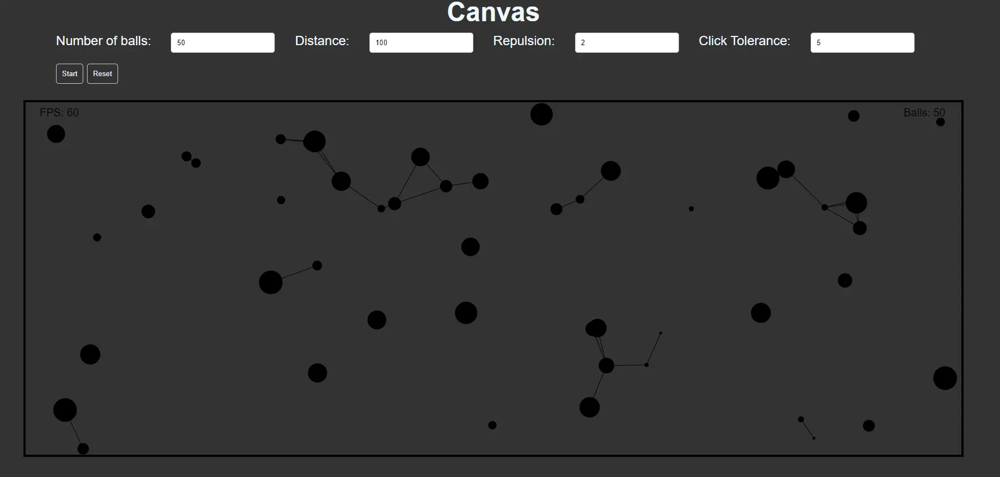
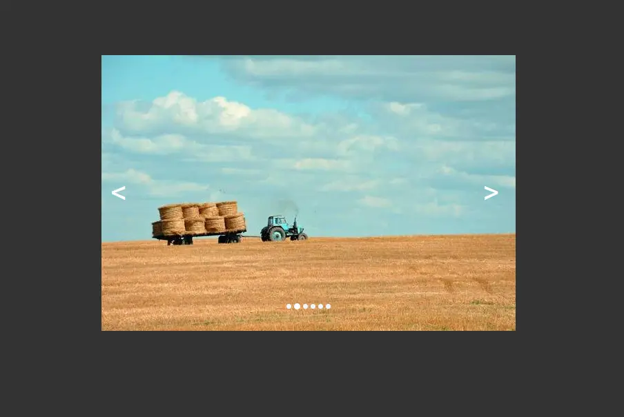
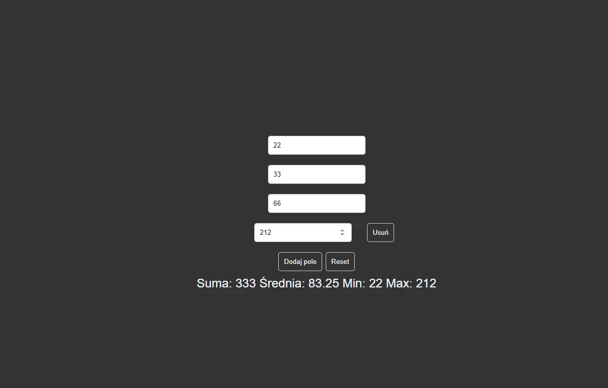
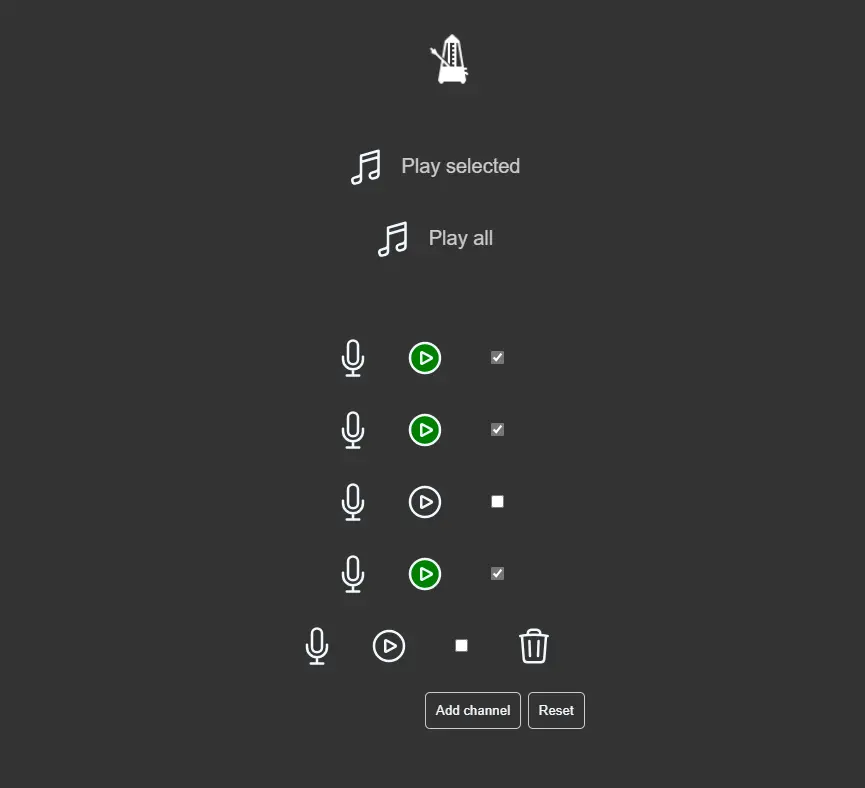

# JavaScript Projects

Created a few cool JS projects during my studies. To run any project, just run the .html file.
## Screenshots of projects

- **Weather App**: - uses openweather API to list current weather in different cities. Results are stored in localstorage.

- **MyNotes App**: - creates simple notes with 4 fiels. Results are stored in localstorage.

- **Canvas**: - moving balls in rectangle with drawn line between. 4 input settings.

- **Slider**: - well, that's just a slider :P

- **Math Operators**: - a warmup project. Results are insta changed as the input changes.

- **Drumkit**: - use your keyboard to play some drums, ba dum tss. 
